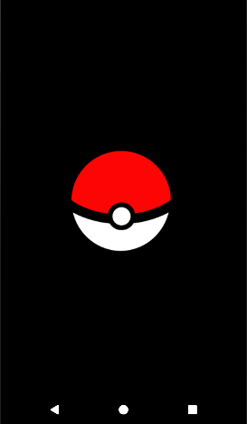
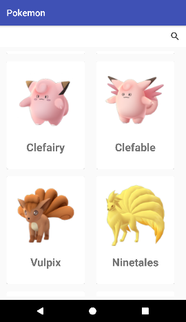
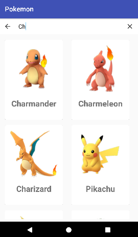
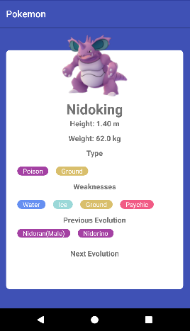
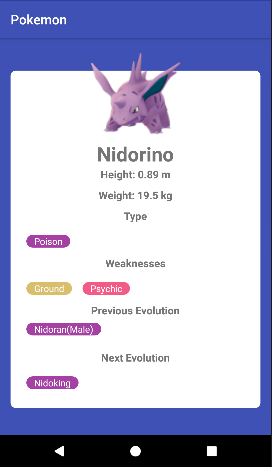
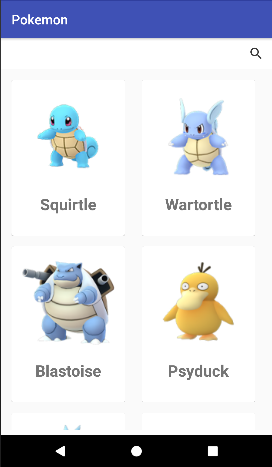
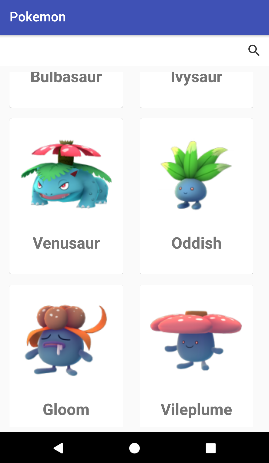

# Application Pokémon

## Membres de l'équipe (4A CFA)

- Amine Azlouk
- Ludovic Carlu
- Maxime Faivre
- Kevin Le Borgne
- Ilyess Marouf

## Présentation

Simple projet démontrant l'utilisation de Clean Architecture et du pattern MVVM dans une application android codé en Kotlin.

Cette application affiche le pokédex du jeu pokémon et utilise l'API de Github permettant d'aller chercher un fichier sur le repo d'un utilisateur Github.

## Prérequis


- Installation d'Android Studio
- Récupérer la branche develop<br/>


````
https://github.com/LudoCarlu/Pokemon.git
````

## Consignes respectées : 

- Clean Architecture & MVVM
- Appels REST
- Ecrans : 3 activités, 3 fragments
- Affichage d'une liste dans un RecyclerView
- Affichage du détail d'un item de la liste
- Gitflow propre
- Fonctions supplémentaires :
	- Barre de recherche
	- Filtrage de la liste en fonction du type des pokémons (Puce cliquable dans le détail)
	- Redirection sur les détails des évolutions des pokémons


## Fonctionnalités: 

### Premier écran 

- Splash affichant une pokeball.



### Ecran Home 

- Affiche la liste des pokémons avec une barre de recherche.

   

### Ecran du détail du pokémon

- Affiche les différentes informations sur le pokémon 
- Puces type, weaknesses, previous evolution et next evolution sont cliquables 
- Redirection en fonction de la puce  :
	- Type, weaknesses : Vers la liste des pokémons du type selectionné 
	- Evolution : Vers le détail du pokémon selectionné

  

### Filtres 

Affichage obtenu avec la selection des types eau et plante

  


